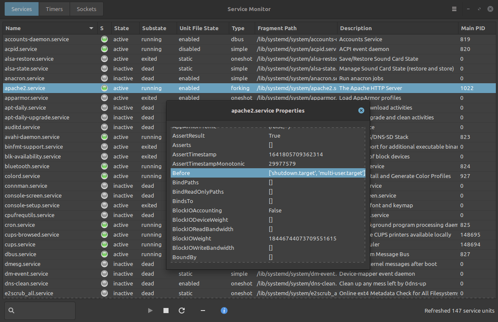

Service Monitor
===============

Live monitor for *systemd* units.

Queries Services, Timers and Sockets through the Manager interface on
DBus and supports starting, stopping, restarting or enabling/disabling
unit files.

**Note** this is an early release that hasn't had a lot of real world testing yet.
Help with testing and issues is very welcome through github

* https://github.com/thekhalifa/servicemonitor

How to install
--------------
As this uses python3 and queries DBus through GLib, the following dependencies
are needed:

* python3
* python3-gi (gobject-introspection)

It's a simple python application so there is no automake or meson or pip, but there is
supplied make script that will install a few files and icons for you
::
    git clone https://github.com/thekhalifa/servicemonitor
    cd servicemonitor
    sudo make manual-install

Then you should find *Service Monitor* app in your app menu.

Uninstall with the same make script (but it leaves the icons)
::
    sudo make uninstall

How to run locally
------------------
You can run the application from the current directly, but some icons will be missing
::
    chmod u+x servicemonitor-local.py   # if needed
    ./servicemonitor-local.py

Todo
----
* Move actions to separate thread so it doesn't block UI
* Info dialog: Add copy to clipboard for main treeview or info treeview

